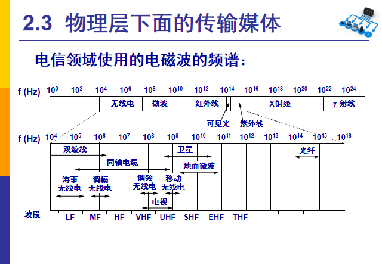

# 2.1 物理层的基本概念

物理层考虑的是怎样才能在连接各种计算机的传输媒体上，传输数据比特流。尽可能屏蔽传输媒体和通信手段的差异，使物理层上面的数据链路层感觉不到这些差异，使得数据链路层只需要考虑如何完成本层的协议和服务。

物理层协议，又称为物理层规程(procedure)

**物理层的主要任务**：确定与传输媒体的接口有关的一些特性。

1. **机械特性**：接口形状尺寸、引线数目和排列、固定和锁定装置等
2. **电气特性**：指明接口电缆的各条线上的电压范围
3. **功能特性**：指明某条线上某一电平的电压表示的意义，与电气特性相互对照
4. **规程特性**：指明对不同功能的各种可能事件的出现顺序

---

# 2.2 数据通信的基础知识

## 2.2.1 数据通信系统的模型

## 

一个通信系统分为三大部分：

1. 源系统(/发送端/发送方)
   1. 源点（/源站/信源）：源点设备产生要传输的数据，可理解为个人电脑
   2. 发送器：将源点生成的数字比特流进行编码后，在传输系统中传输
2. 传输系统(/传输网络)
   1. 数据：运送信息的实体，不是信息。如计算机中的数据是01字符串，没有实际意义
   2. 信号：数据的电气/电磁的表示
   3. 模拟的：连续变化
   4. 数字的：取值是离散数值
   5. 调制：数字信号->模拟信号
   6. 解调：模拟信号->数字信号
3. 目的系统(/接收端/接收方)
   1. 接收器：接收信号，把它转换为能够被目的设备处理的信息
   2. 终点：获取接收器传送来的数据比特流，然后把信息输出

## 2.2.2 有关信道的几个概念

1. **单向通信**（单工通信）：只能有一个方向的通信而没有反向的交互
2. **双向交替通信**（半双工通信）：可以互相发送信息，但不能同时发送/接收
3. **双向同时通信**（全双工通信）：可以同时互相发送和接收信息

**基带信号**：来自信源的信号，如文字/图像文件的数据信号。将数字信号1/0直接用两种不同的电压表示，送到线路上传输

**带通信号**：将基带信号进行调制后形成的频率转换为模拟信号

**调制**

1. 基带调制：对基带信号的波形进行变换，变换后的信号仍然是基带信号

   1. 不归零制：正电频——1，负电频—0

   2. 归零制：正脉冲——1，负脉冲——0

   3. 曼彻斯特编码：位周期中心的向上跳变——1，位周期中心的向下跳变——0

   4. 差分曼彻斯特编码：位开始边界跳变——1，位开始边界没有跳变——0

      曼彻斯特编码和差分曼彻斯特编码具有自同步能力，他们产生的信号频率较高。
      
      

2. 带通调制

   1. 调幅(AM)：0/1分别对应无/有载波输出

   2. 调频(FM)：0/1分别对应频率$f_1$/$f_2$

   3. 调相(PM)：0/1分别对应相位$0^o$/$180^o$

      
   
   

## 2.2.3 信道的极限容量

1. **信道能够通过的频率范围**

   码元传输的速率是有上限的，否则会出现码间串扰的问题。

   信道的频带越宽，能通过的信号高频分量越多，可以用更高的速率传送码元而不出现码间干扰。

   1924年，提出了奈式准则，给出了理想条件下码元传输速率的上限值。

2. **信噪比**

   噪声使接收端对码元的判决产生错误。信噪比就是信号的平均功率和噪声的平均功率之比，记作S/N，单位为分贝(dB)

   信噪比(dB)=10$log_{10}{S/N}$(dB)

   **香农公式**：信道的极限信息传输速率C=W$log_{2}{(1+S/N)}$ bit/s，W(Hz)为信道带宽，S为信道内所传信号的平均功率，N为信道内部的高斯噪声功率。

---

# 2.3 物理层下面的传输媒体

**传输媒体**：数据传输系统中发送器和接收器之间的物理通路，分为导引型传输媒体和非导引型传输媒体。

## 2.3.1 导引型传输媒体

电磁波被导引沿着固体媒体传播

1. 双绞线：通信距离一般为几到几十公里
2. 同轴电缆：有很好的抗干扰特性，被广泛用于传输较高速率的数据
3. 光缆：光纤通信就是利用管道纤维传递光脉冲来进行通信

## 2.3.2 非导引型传输媒体

在非导引型传输媒体中，电磁波的传输通常称为无线传输，

用无线电波在自由空间的传播可较快的实现多种通信，适用频段很广。

---

# 2.4 信道复用技术

## 2.4.1 频分复用、时分复用和统计时分复用

1. 频分复用：把不同频段分给不同用户
2. 时分复用：在不同的时间占用相同的频带宽度
3. 统计时分复用：不固定分配时隙，按需动态分配时隙，每个时隙中必须有用户的地址信息

## 2.4.2 波分复用

波分复用(WDM)是光的频分复用

## 2.4.3 码分复用

各用户使用经过特殊挑选的不同码型，因此不会造成干扰。

**码片**(chip)：每一个比特时间划分为m个短的间隔

**码片序列的特性**：

1. 互相正相交：每个站分配的码片序列不仅必须各不相同，并且还必须互相正交，即：

   $S·T=\frac{1}{m}\sum_{i=1}^mS_iT_i=0$

   另向量**S**为：(-1 -1 -1 +1 +1 -1 +1 +1)

   另向量**T**为：(-1 -1 +1 -1 +1 +1 +1 -1)

2. 内积为1/-1：任何一个码片向量和该码片向量自己的规格化内积都是1；一个码片向量和该码片反码向量的规格化内积值是-1。即：

   $S·S=\frac{1}{m}\sum_{i=1}^mS_iS_i=\frac{1}{m}\sum_{i=1}^mS_i^2=\frac{1}{m}\sum_{i=1}^m(±1)^2=1$

   $S·S_反=-1$

---

# 2.5 数字传输系统

旧的数字传输系统缺点：

1. 速率不统一
2. 不是同步传输

1988年美国推出数字传输标准——同步光纤网SONET

**SONET体系架构**

1. 光子层(Photonic Layer)：处理跨越光缆的比特传送
2. 段层(Section Layer)：在光缆上传送STS-N帧
3. 线路层(Line Layer)：负责路径层的同步和复用
4. 路径层(Path Layer)：处理路径端接设备PTE之间的业务的传输

---

# 2.6 宽带接入技术

## 2.6.1 ADSL技术

非对称用户数据线ADSL技术，是用数字技术现有的模拟电话用户线进行改造，使它能够呈载带宽数字业务

## 2.6.2 光纤同轴混合网(HFC网)

光纤同轴混合网(HFC网)是在目前覆盖面很广的有线网，在电视网的基础上开发的一种居民宽带接入网，可以传送电视节目、提供电话、数据和其他宽带交互型业务。

## 2.6.3 FTTx技术

光纤到户，就是把光纤一直铺设到用户家庭。只有在光纤进入用户家门后，才把光纤信号转换为有线信号。