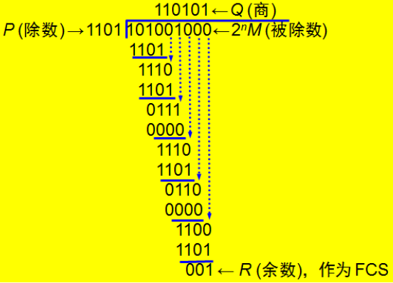

# 3.1  使用点对点信道的数据链路层

## 3.1.1 数据链路层和帧

**链路：**无源的点到点的物理线段，中间没有任何其他的交换节点。

**数据链路：**物理线路+实现通信协议的硬件和软件

**帧：**在数字链路层之间的数字管道上传输的数据

---

## 3.1.2 基本问题

1. **封装成帧**

   在数据前后分别添加首部(SOH)和尾部(EOT)，他们不仅能标识帧的开始和结束位置，其中还包含了一些控制信息

   **最大传送单元MTU：**每种链路层协议都规定了所能传送的帧的数据部分长度上限

2. **透明传输**

   无论什么样的比特组合的数据都能通过这个数据链路层

   若报文里本来就含有EOT，那么就没办法透明传输，因此数据链路层要通过字符填充法来弥补透明传输的缺陷，即在EOT/SOH前加一个ESC，它是一个转义字符。

3. **差错检测**

   **误码率BER：**传输错误的比特占所传输比特总数的比率。$BER=10^{-10}$表示每传送1010个比特就会出现一个比特的差错

   冗余检验CRC：

   1. 在发送端把数据划分为组，假定每组k个比特，待传送数据M=1010001101(k=10)。CRC运算在数据M的后面添加n位冗余码（帧检验序列FCS），组成帧发送出去，一共发送(k+n)位。

      **CRC是检错方法，FCS是冗余码；FCS可由CRC得出，也可由其他方法得出**

      **例:**

      设n=5,除数P=110101，模2运算的结果是：Q=1101010110，余数R=01110。

      将余数R添加在数据M的后面发送出去，即发送101000110101110

      

   2. 在接收端把收到的数据以帧位单位进行CRC检验：每个帧除以除数P，再检验得到的余数R

   3. 经过CRC检验后，有两种情况：

      1. 若R=0，则帧无差错，接收
      2. 若R≠0，帧有差错，丢弃

   **CRC的缺陷：**

   只能做到无差错接受，可能会丢弃一点小错的数据，造成浪费，要做到“可靠传输”就必须加上确认和重传机制

4. 流量控制

   主机A向主机B传输数据的信道为无差错的理想信道，但不能保证接收速率永远比发送速率快。于是用流量控制来弥补两端的差异，约定由**收方**控制数据率。

   **在发送节点：**

   1. 从主机取一个数据帧
   2. 将数据帧送到数据链路层的发送缓存区
   3. 将发送缓存中的数据中发送出去
   4. 等待
   5. 收到接收结点发过来的信息，从主机取新数据帧，回到步骤2

   **在接收结点：**

   1. 等待
   2. 收到发送结点发送来的数据帧，将其放入数据链路层的接收缓存。
   3. 将接收缓存中的数据帧上交到主主机
   4. 向发送节点发送信息
   5. 回到步骤1

   **四种情况：**

   

   * 超时计时器设置的重传时间可选为：略大于从发完数据帧到收到确认帧所需的平均时间
   * 第四种情况可以用帧编号的方式来防止重复接收相同数据帧
   * 帧编号会导致编号过大，所以使用0和1进行滚动编号，前后不同就是正常，前后相同就是出现重复

---

# 3.2 点对点协议PPP

PPP协议(Point-to-Point Protocol)是用户计算机和ISP进行通信时所使用的数据链路层协议。

## 3.2.1 PPP协议的特点

**一、PPP协议应满足的需求**

1. 简单
2. 分装成帧
3. 透明性
4. 多种网络层协议（向上兼容）
5. 能在多种类型的链路层上传输（向下兼容）
6. 差错检测
7. 检测链路状态
8. 最大传送单元
9. 网络层地址协商（除源地址和目的地址外，中间的所有物理设备都有地址）
10. 数据压缩协商

MAC地址：唯一标识上网设备的地址

**二、P2P协议的组成**

1. 一个将IP数据报封装到串行链路的方法
2. 一个用来建立、配置和测试数据链路层连接的链路控制协议LCP（物理层）
3. 一套网络控制协议NCP（逻辑层）

---

## 3.2.2 P2P协议的帧格式

1. 各字段的意义

   

   * 标志字段F为$0x7E=(01111110)_2$，是开始字符
   * 地址字段A为$ 0xFF$
   * 控制字段C为$0x03$
   * 支持的协议
   * 运输层发送下来的信息
   * FCS是检验序列码
   * F是结束字符

2. 字符填充问题

   PPP用在同步传输链路时，协议规定采用硬件来完成比特填充，与逻辑层无关

   * 将信息字段中出现的每一个0x7E字节(开始和结束标志)转变为2字节序列(0x7D,0x5E)
   * 若单独出现0x7D，则转变为2字节序列(0x7D,0x5D)
   * 若出现ASCII码的控制字符（即小于0x20的字符），则在该字符前面加一个0x7D子节，同时将该字符的编码加以改变

3. 零比特填充

   PPP协议在SONET/SDH链路时使用同步传输（一连串的比特连续传送），采用零比特填充来实现透明传输

   * 在发送端下扫描整个信息字段
   * 每5个连续的1后面填入一个0
   * 接收端在收到一个帧时，先找到标志字段F以确定边界，再对比特流扫描
   * 每5个连续1，就删除后面的一个0还原

   

   ---

   

   ## 3.2.3 PPP协议的工作状态

   ​		用户拨号接入ISP（网络服务提供商）时，路由器的调制解调器对拨号做出确认、建立物理连接。PC机向路由器发送一系列LCP分组，以封装多个PPP帧。

---

# 3.3 使用广播信道的数据链路协议

## 3.3.1 局域网的数据链路层

常见拓扑结构：

总线网、星形网、环形网、树形网

主要研究总线结构

**媒体共享技术：**

1. 静态划分信道
   * 频分复用
   * 时分复用
   * 波分复用
   * 码分复用
2. 动态媒体接入控制
   * 随机接入
   * 受控接入

**以太网的两个标准：**DIX Ethernet V2标准，IEEE的802.3标准(将802.3局域网简称以太网)

**数据链路层的两个子层：**

1. 逻辑链路控制LLC（逻辑层）
2. 媒体接入控制MAC（物理层）

**适配器的作用：**

* 进行串行/并行转换（把传输层拿到的东西封装成帧在物理线路上进行传输）
* 对数据进行缓存（流量控制中，数据发送时的缓存通过网卡进行）
* 在计算机的操作系统安装设备驱动程序（任何硬件设备都应该是可控的，传输层可以调用网卡的驱动设备来发送数据）
* 实现以太网协议（即PPP协议）

---

## 3.3.2 CSMA/CD协议

为了避免数据链路层中，由于随机接入导致的数据相互影响，使用CSMA/CD协议。

**广播发送方式的优点**（即A发送给D的信息，BCE都能收到，但是拒接）：

* 采用较为灵活的无连接的工作方式，即不必先建立连接就可以直接发送数据
* 以太网对发送的数据帧不进行编号，也无需对方发回确认
* 这么做是因为局域网信道的质量很好，出差错的概率很小

**以太网提供的服务：**

* 它是**不可靠的**交付，即尽最大努力的交付
* 当目的站收到有差错的数据帧时就丢弃此帧，**差错的纠正由高层决定**
* 若高层发现丢失了数据而进行重传，但以太网并不知道这是一个重传的帧，而是一个**新的数据帧**来发送

**载波监听多点接入/碰撞检测CSMA/CD:**

* **多点接入：**许多计算机在总线上以随机接入方式连接在一起
* **载波监听：**每个站在发送数据之前先检测以下总线上是否有其他计算机在发送数据，若有就暂时不发送数据，以免发生碰撞
* **碰撞检测：**计算机边发送数据边检测信道上的信号电压大小。若检测到信号电压摆动值超过一定的门限值时，就认为总线上至少有两个站同时在发送数据，发生了碰撞，即总线上传输的信号产生严重失真，无法恢复有用信息。出现碰撞应立即停止发送，等待一段随机时间后再发送。

**特性：**

* 使用CSMA/CD协议的以太网不能进行全双工通信，只能进行半双工通信
* 每个站在发送数据后的一小段时间内，有遭遇碰撞的可能性
* 这种不确定性使整个以太网的平均通信量远小于以太网的最高数据率

（这就是为什么2M的网线可能实际网速只有200k）

**争用期（端到端往返时间2t）：**

* 最先发送数据帧的站，最多经过2t时间，就可以检测到是否碰撞
* 经过争用期后未检测到碰撞，才能肯定肯定这次发送不会发生碰撞
* 以太网取51.2μs为争用期长度。10Mb/s的以太网，在争用期内可发送512bit（64字节）

重传16次仍不能成功，就丢弃该帧，向高层报告

**强化碰撞：**

停止发送+发送干扰信号让所有人知道这里发生了碰撞

---

## 3.3.3 使用集线器的星型拓扑

使用集线器的星形拓扑 

物理上星形网，逻辑上总线网； 

一个集线器有许多接口； 

集线器工作在物理层，每个接口仅仅简单地转发比特，不进行碰撞检测；

集线器是物理层工作的链接设备

---

## 3.3.4 以太网的信道利用率

* 发送一帧所需的平均时间$T_{av}$：开始发送-碰撞后数次重传-发送成功且信道转为空闲
* 总线上共N个站，每个站发送帧的概率均为p
* 争用期长度为2τ：端到端传播时延的两倍
* 帧长为L(bit)
* 数据发送速率为C(bit/s)
* 帧的发送时间为$T_0(s)=\frac{L}{C}$

P[某个站发送成功]=$Np(1-p)^{N-1}$

P[争用期为j个]=$(1-A)^jA$，(A是发送成功的概率)

争用期的平均个数等于帧重发的次数：$N_R=\sum_{j=0}^{∞}j(1-A)^jA=(1-A)^jA$

以太网的信道利用率：

$S=\frac{T_0}{T_{av}}=\frac{T_0}{3τN_R+T_0+τ}=\frac{1}{1+a(2A^{-1}-1)}$,其中$a=\frac{τ}{T_0}=\frac{τC}{L}$（τC是时延带宽积）

$p=\frac{1}{N}时，有A_{max}=[1-\frac{1}{N}]^{N-1}$，N→∞时，$A_{max}=\frac{1}{e}=0.368$，此时信道利用率最大$S_{max}≈\frac{1}{1+4.4a} （N→∞）$

---

## 3.3.5 以太网的MAC层

MAC地址：48bit（6子节）（前三个子节标识生产厂商，后三个子节表示扩展的型号等信息）

路由器有2个MAC地址，其他物理设备都只有一个

MAC帧的分类：单波帧（一对一）、广播帧（一队全体）、多播帧（一对多）

最常用的MAC帧标准是以太网V2(DIX Ethenet V2)的格式：

* 类型里开辟2个子节存放支持的协议

* FCS是帧检查冗余序列

* 头部添加的8个字节中，前7个字节是前同步码，用于同步频率；后一个字节是帧开始定界符，不属于MAC帧，表示后面的信息是MAC帧

* 数据字段的最小长度=最小长度64字节-18子节的首部和尾部=46字节

  数据字段的最大长度=1500

  因此有效的MAC帧长度范围为：[64,1518]

帧间最小间隔：9.6μs，相当于96bit的发送时间

---

# 3.4 扩展的以太网

## 3.4.1 在物理层扩展以太网

优点：

1. 进行跨碰撞域通信
2. 扩大地理范围

缺点：

1. 碰撞域增大，吞吐量却未提高
2. 数据率不同则无法用集线器互连

---

## 3.4.2 在数据链路层扩展以太网

**网桥：**根据MAC帧的目的地址对收到的帧进行转发。

* **作用：**过滤帧。不直接向所有端口转发发送来的帧，而是先检验帧的目的MAC地址，再确定该送到哪一个端口。

（网桥和集线器不是并存的，网桥替代了集线器）

* **优点：**

1. 过滤了通信量
2. 扩大了物理范围
3. 提高了可靠性
4. 可互连不同物理层、不同MAC子层和不同速率的局域网

* **缺点：**

1. 存储转发增加了时延
2. 在MAC子层没有流量控制功能
3. 不同MAC子层的网段桥接时延更大
4. 适合用户数不多、通信量不大的局域网，否则会网络拥塞

**多端口网桥——交换机：**每个端口直接与主机相连，且一般都工作在全双工方式。若每个端口的带宽是10Mb/s，则有N对端口的交换机总带宽是N*10Mb/s。

---

## 3.4.3 虚拟局域网VLAN

由一些局域网网段构成的与物理位置无关的逻辑组

**虚拟局域网使用的帧格式：**

添加4个字节的标识符，用于标记发送帧属于哪一个虚拟局域网

---

# 3.5 高速以太网

## 3.5.1 100BASE-T以太网

速率>=100Mb/s的以太网称为高速以太网，使用IEEE802.3的碰撞检测检协议CSMA/CD

(注：只有使用集线器、网桥才会产生碰撞，才需要用到CSMA/CD协议；交换机每个用户使用一个总线，所以不会产生碰撞，不用CSMA/CD协议)

网段最大电缆长度减小到100m，帧时间间隔从9.6μm改为0.96μm

---

## 3.5.2 吉比特以太网

**载波延伸：**

由于$a=\frac{τC}{L}$，数据率C提高了，因此要增大L，才能使a保持较小的数值，从而保证信道利用率不降低，采用“载波延伸”对帧长进行扩充。MAC帧不足512字节时，在帧后填充特殊字符。

**分组突发：**

很多短帧一起发送时，第一个短帧进行载波延伸，其他短帧留有必要的最小帧间隔即可。

全双工通信（即使用交换机通信）时，不需要使用载波延伸和分组突发。

---

## 3.5.3 10吉比特以太网和更快以太网

**以太网特点：**

1. 可扩展的
2. 灵活的
3. 易于安装
4. 稳健性好

---

## 3.5.4 使用以太网进行宽带连入

